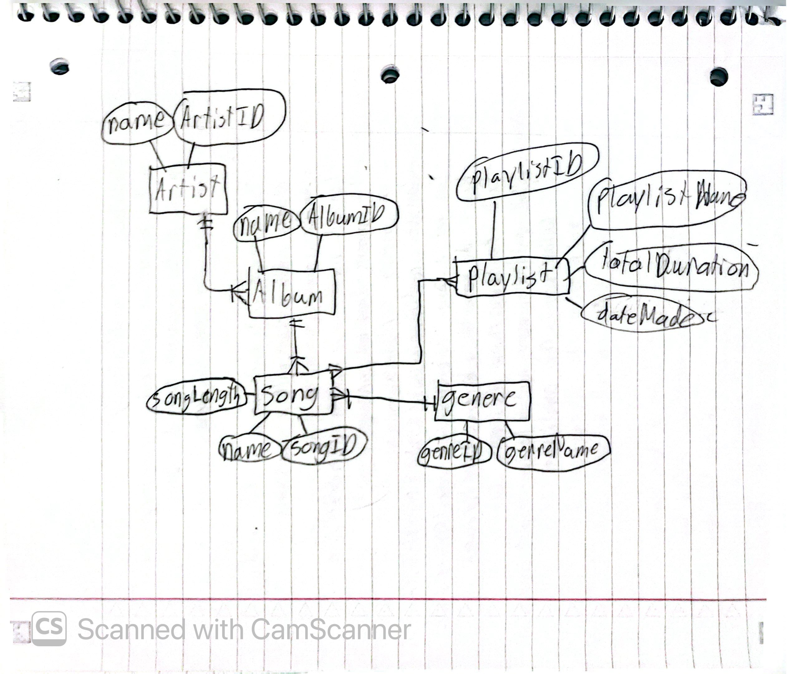

## Purpose
A conceptual model is made on a high level where the person or organization creating the model defines what they want to track and how they want to track them.
## Entity
An entity is a represents a thing that has data of interest to an organization that needs to be stored
## Attribute
An attribute is the main characteristics of an entity that the organization wants to store
## Relationship
A relationship defines how one entity can relate to another entity

# Our model

## Entities
* Artist  
  * Name
  * ArtistID
* Album
  * name
  * AlbumID
* Song
  * name
  * songID
  * songLength
* Genre
  * genreID
  * genreName
* Playlist
  * playlistID
  * playlistName
  * totalDuration
  * dateMade
## Relationships
Artist to Album (one to many)
Album to Song (one to many)
Song to Genre (many to many)
Song to Playlist(many to one)
## Description
Our app starts with an artists of a song.  They will only have two attributes a name and an id. There won't be any more because our user is the one that are creating random playlist and not artist.  The user doesn't need to interact with the artist in a playlist besides knowing their name.    

The artist will be connected to the albums that they create.  These albums will have a name and an albumID to differentiate them. They don't need anymore attributes because our user doesn't need to interact with anything beyond the name.  

Inside the albums are songs.  These songs will have a name, songID, and songLength.  This is to differentiate them and give stats that the user could use.  

The songs will then have a genre this is a simple entity with a genreID and a name.  This is only for giving a song a genre and the user doesn't interact with it so it only needs two attributes.  

Finally the songs are put into a playlist. The playlist have a playlistID to differentiate the list, a playlistName, A totalDuration for all the songs, and a date the playlist was created.