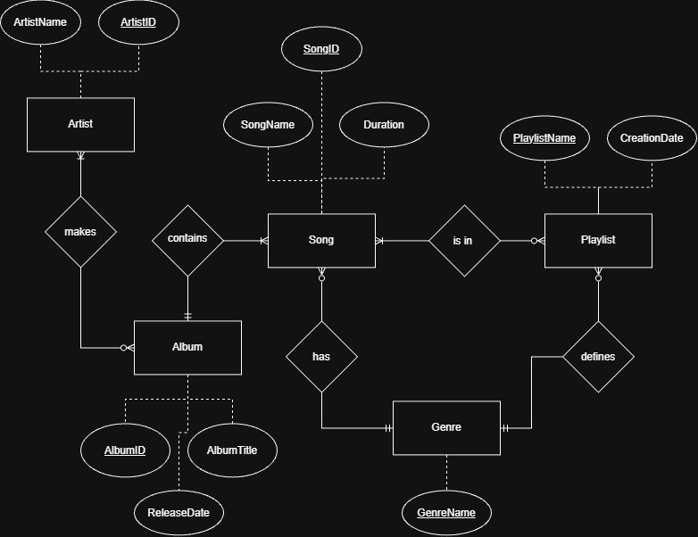

# Database Conceptual Model
## Key Definitions
- Purpose of a Conceptual Model: Define the business level of the database. What are objects are we storing, what do we want to know, and how do they relate to one another?
- Entity: This is an object. A person, place, or thing. This is what bears attributes. E.G. Employee or Department
- Attribute: Things about an entity. E.G Hair Color, department name
- Relationship: How two entities relate to one another. E.G. An employee is in a department and a department has many employees. 

## Conceptual Model

### Entities & Attributes
1. Artist
    - ArtistID
    - ArtistName
2. Album
    - AlbumID
    - AlbumTitle
    - ReleaseDate
3. Songs
    - SongID
    - SongName
    - Duration
4. Genre
    - GenreName
5. Playlist
    - PlaylistName
    - CreationDate

### Relationships
- Artist make Album (many-to-many)
- Album contains Song (one-to-many)
- Song is in Playlist (many-to-many)
- Song has Genre (many-to-one)
- Genre defines Playlist (one-to-many)

### Description
Our app focuses on the random generation of playlists within a defined genre. 

The model includes Playlists, which are defined off of a genre and populated with songs from within that genre. Those songs each come from an album, which are made by an artist. 

This makes the entities: Artist, Album, Song, Genre, and Playlist. 

It is worth noting that zero of these entities meets the required four attribute mark. The reason for this is simple: We do not need that data. 

A Playlist is a container of songs. It has a name and the date it was created that can be used for sorting purposes. As we are not using user accounts at this stage, the playlist has no owner, the duration of the playlist could be calculated, and playlist behavior is clearly defined by our app's plan. Playlists have a single genre they are generated from. 

A Genre is merely a simple lookup table. It has a unique name and nothing else. Adding more data such as description or energy level would add unneccessary bloat. Songs have genres. 

A song has more info. It has a unique ID, a duration, and a name. A song comes from an album. 

An Album is a grouping of songs. An album has an ID, a title, and a ReleaseDate. Albums are authored by Artists.

Artists have a name and an ID. For this app, we do not need to store a bio, and country of origin, or anything beyond just the name of the artist. Potentially in the future we would want to add monthly listeners or some value like that, but for MVP, this is not in scope. 

This conceptual model contains the data we need, plus some data that could be convenient for sorting or serving as meaningful identifiers to the user, and nothing else. Adding more attributes for no reason other than to meet the four attribute requirement would add unneccessary bloat. Additionally, with this data alone, much of the data that a user might want is able to be calculated. Values such as number of songs in a playlist, overall duration of a playlist, number of playlists, etc. 

These five entities are what are neccessary to accomplish our goal. Collapsing them into one another would actually complicate the design and violate normalization rules rather than simplify things. 