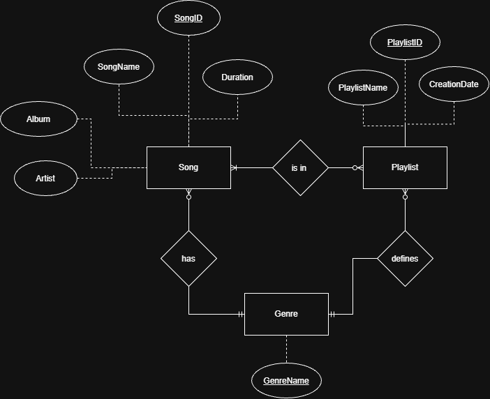

# Emberlights Database - Conceptual Model
## Group Conceptual Model

### Entities & Attributes
1. Song
    - SongID
    - SongName
    - SongDuration
    - Artist
    - Album
2. Genre
    - GenreName
3. Playlist
    - PlaylistID
    - PlaylistName
    - CreationDate
### Relationships
- Song is in Playlist M:M
- Song has Genre M:1
- Genre defines Playlist 1:M
