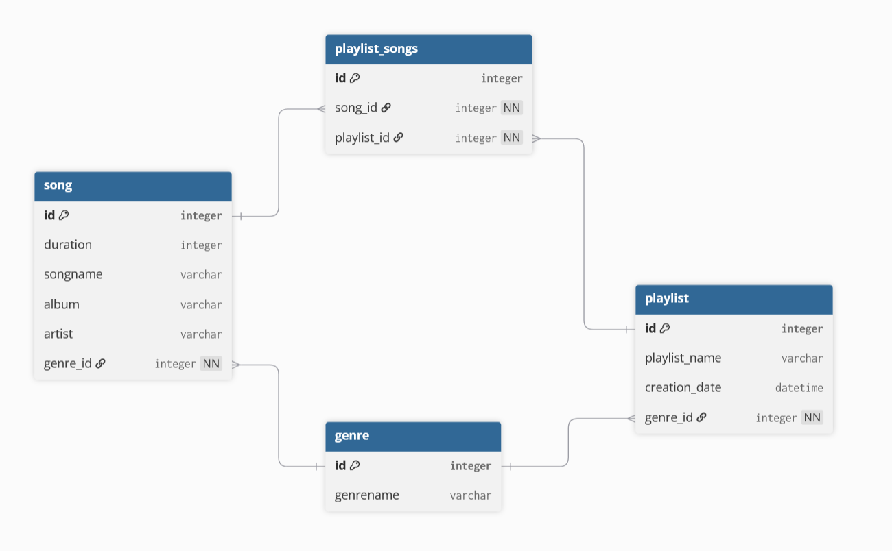

# McGohan Logical Model

* Logical Model
    * Database blueprint that displays details about entities, attributes, and relationships. This is made independent from any database management software.
* Primary Key
    * Unique identifier to a table, cannot be shared between different tables. Used to reference a specific table
* Foreign Key
    * Primary key from one table that links two tables.
* Relationships between entities
    * Logical connection between two entities via foreign keys and primary keys.
    * Example: `Employees` are assigned to a `Manager` via a `manager_id`
* Normalization
    * Process of reducing data redundancy to ensure data integrity

[Link to Emberlights conceptual model](https://github.com/AMcGohan/cs4900-EmberLights-Database/tree/main/conceptual_model)

`song` and `playlist` need a table for their many-to-many relationship to track what song belongs to what playlist.

`song` references a genre based on the given `genre_id`. Relationship between `song` and `genre` is `M:1`.

`playlist` references a genre based on the given `genre_id`. Relationship between `playlist` and `genre` is `M:1`.