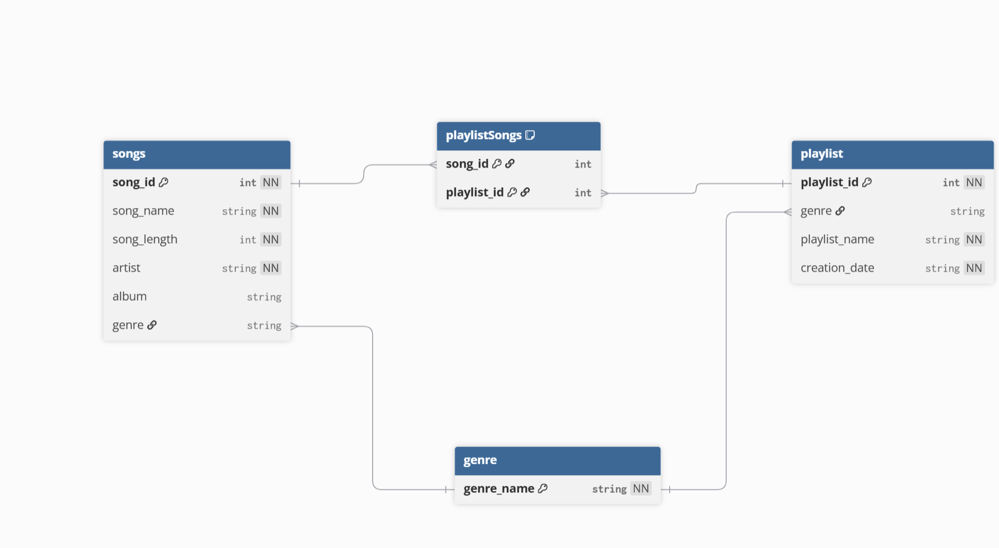

# Definitions
## Purpose
The purpose of a logical model is to be used a blueprint of what you want your database to look like before you actually start to build the database.
## Primary Key
This key is unique identifier for a specific set of information that won't repeat
## Foreign Key
A foreign key is a set of information that is taken from another table and used in the current table
## Relationships between entities
The relationships between entities describes how one table interacts with another. This can be described as one-to-one, or many-to-one, or many-to-many.
## Normalization
Normalization is the process that a database designer must go through to make sure that their design is made in such a way that it protects from data redundancies and bad information.  
# Models

## Conceptual
Our conceptual model can be found [here](../conceptual_model/README.md)
## Logical
This is my design for our logical model

In my design for our logical model we have four tables unlike our conceptual model.  The ones that I have carried over is the songs, playlist, and genre tables.  
The most basic table in our design is the genre table. This table will be used to have predefined genres that can make sure that a playlist that is of a genre will only have songs of that genre in it.  This only has one column genre_name.  This can be used as the primary key because there should be no duplicate names entered.  
The next table is the songs table.  This table will represent the songs that will be put into the playlist.  Each song will need to use a song id as a primary key because song names and artists could repeat very often. There is also other information about the song like length and artists that are tracked here too. In this table there exists a foreign key linking to the genre table. This key is here to ensure that each song has a predefined genre.  
Then there is the playlist table. This table represents the playlist that the songs will be in.  This needs its own id as playlist name can be repeated. Similar to the songs table the playlist also needs a foreign key to the genre table as a playlist can only have songs of one genre inside the playlist.  
The final table is the playlistSongs.  This table represents what playlist are in which playlist.  As such the table has two foreign keys song_id and playlist_id that represents what song is in which playlist.