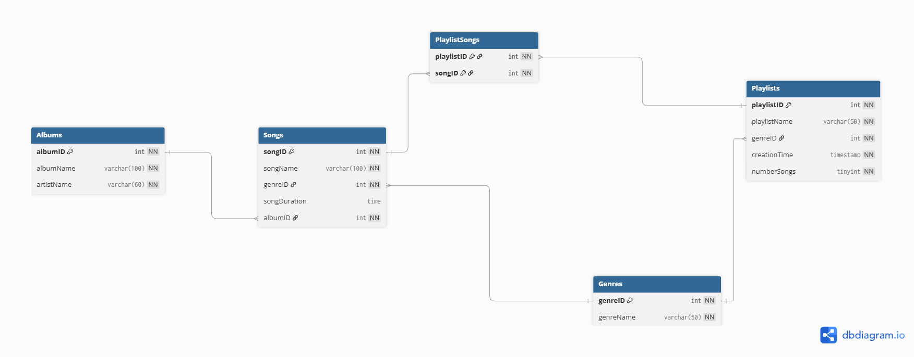

# Physical Model - Mallia
## Decription of Components
- Key Difference of the Physical Model to the Conceptual and Logical Models
    - The **physical model** defines how the database will actually be implemented, whereas the **logical model** describes how data will be organizaed and accessed, and the **conceptual model** identifies what information we need and what the relationships between them are. 
- Common Data Types
    - Numeric
        - int
        - float / double
        - decimal / numeric
        - bigint
    - String/Text
        - varchar
        - char
        - text
    - Date & Time
        - date
        - time
        - datetime
        - timestamp
    - Boolean / bit
- Default Values / Null Values
    - These define what happens in a database when no value is passed in. If a *default value* is set, then the database will fill in that field with a specified fallback value. A NULL, is what occurs when there is no data. It is unknown or missing, not a value itself. If a field is nullable and no default value is set, a field will be set to NULL.
- Check Constraints
    - A DBA may set a check constraint on a field. A check constraint is a boolean validation that must be passed before the value is added to a database. An example of a check constraint may be that an integer `count` field must be greater than or equal to zero to be valid. 

## Group Logical Model
[Group Logical Model](https://github.com/AMcGohan/cs4900-EmberLights-Database/tree/main/logical_model)

## Physical Model

```
Table Songs {
  songID int [pk, increment, not null]
  songName varchar(100) [not null]
  genreID int [not null, ref: > Genres.genreID]
  songDuration time [check: `songDuration IS NULL OR songDuration > '00:00:00'`]
  albumID int [not null, ref: > Albums.albumID] 
}

Table Genres {
  genreID int [pk, increment, not null]
  genreName varchar(30) [not null]
}

Table Playlists {
  playlistID int [pk, increment, not null]
  playlistName varchar(50) [not null]
  genreID int [not null, ref: > Genres.genreID]
  creationTime timestamp [not null, default: `CURRENT_TIMESTAMP`]
  numberSongs tinyint [not null, check: `numberSongs >= 0`, default: 10] //This is a fixed value, not a running count
}

Table PlaylistSongs {
  playlistID int [not null, ref: > Playlists.playlistID]
  songID int [not null, ref: > Songs.songID]
  indexes {
    (playlistID, songID) [pk]
  }
}

Table Albums {
  albumID int [pk, increment, not null]
  albumName varchar(100) [not null]
  artistName varchar(60) [not null]
}
```

### Explanation
This physical model defines the implementation of our conceptual model for MariaDB. It consists of five tables, three of which are entities, one is a lookup table, and one is a intermediary table. 

IDs in this model are integers that are auto incremented. 

A song's attributes, excluding keys, are its name and duration. `songName` is a varchar of length 100 and may not be null as this information is vital to identify the song to the user. `songDuration` is a time in the form `hh:mm:ss` and has a check constraint enforcing that it is either null or positive. 

A `genreName` is limited to 30 characters and may not be null as the lookup table is meaningless without it. This character limit should be analyzed later to determine if it is sufficient. 

A Playlist's attributes, excluding keys, are its name, creation time, and number of songs. A `playlistName` is a varchar of length 50 and may not be null. **TODO Look into making a default with incrementing???** A `creationTime` is a timestamp, may not be null, and will default to the current time. `numberSongs` is a tinyint that is not null and must be positive. This value will default to 10. 

An album's attributes, excluding keys, are its name and artist. `albumName` is a nonnull varchar of length 100. `artistName` is a nonnull varchar of length 60.

Playlists contain a nonnull foreign key reference to `genreID` as a playlist in this app is only meaningful with a genre associated with it. The same is true of Songs. 

Songs contain a nonnull foreign key reference to `albumID`, as a name, artist, and album are usually required for the user to identify a song, so this data must exist for our business case. 