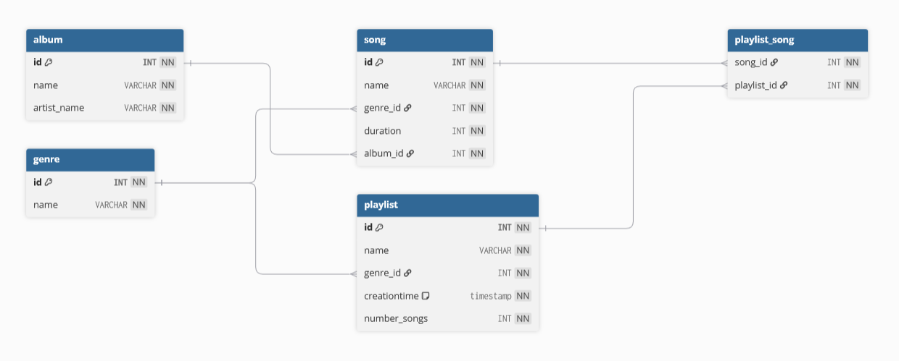

# McGohan Physical Model

## Physical Models vs Conceptual and Logical Models

A Physical Data Model provides more details about attributes, null values, data types, etc. that adhere to the DBMS, whereas the Logical model show a stripped-down version of the database that isn't designed around a specific DBMS.

Source: https://aws.amazon.com/compare/the-difference-between-logical-and-physical-data-model/

## Common Data Types (MariaDB)

Numeric data types:
* `INT` - Standard INteger
* `DECIMAL` - Fixed-point number
* `FLOAT` - Single-precision floating-point number
* `DOUBLE` - Double-precision floating-point number

Boolean:
* `TINYINT` - Used for Boolean values (`TINYINT 0` is false, `TINYINT 1` is true)

String data types:
* `CHAR` - Fixed-length character string
* `VARCHAR` - variable-length non-binary string (most common)
* `TEXT` - Small non-binary string

Source: https://www.mariadbtutorial.com/mariadb-basics/mariadb-data-types/

## Default Values / Null Values

A default value is a value that is automatically inserted into a table if no value is given.

For example, an `OrderDate` for an `Orders` table would use the default value of the current date if no date is given.

A null value is an attribute belonging to an object is given no value in a table, therefore no data exists for that attribute.

Source: https://www.w3schools.com/sql/sql_default.asp

## Check Constraints

Check constraints are conditions that the DBMS checks when an `INSERT` or `UPDATE` statement is passed. If a value contradicts the check constraint, the entire `INSERT` or `UPDATE` statement is terminated and an error is given.

Source: https://www.w3schools.com/sql/sql_check.asp

## Group Logical Model

[Link to Group Logical Model](https://github.com/AMcGohan/cs4900-EmberLights-Database/tree/main/logical_model)

## Physical Model

`album` describes the `name` of the album and the `artist_name` that created thealbum. `id` is referenced to `song.album_id` for users to learn where the song is from.

`genre` contains its primary key and `name`. Primary key is linked to `song.genre_id` and `playlist.genre_id` so users can filter their preferences.

`song` contains `name` of the song, `genre_id`, `duration` of the song in minutes, and `album_id`.

`playlist` contains `name` of playlist, `genre_id` from `genre.id`, `creationtime` (default value is current timestamp), and `number_songs` that tells the user how many songs are in the playlist.

`playlist_song` is an intermediary table between `playlist` and `song` that links all songs in users playlist that they can discover.