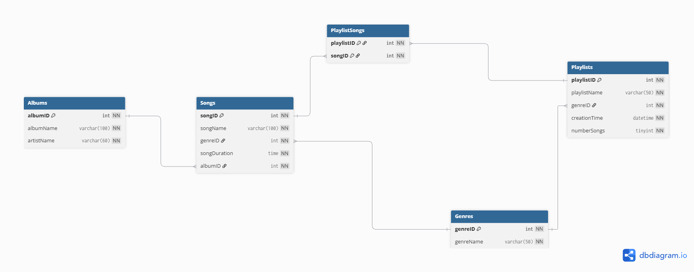

# Group Physical Model
## Diagram


## DBML
```
Table Songs {
  songID int [pk, increment, not null]
  songName varchar(100) [not null]
  genreID int [not null, ref: > Genres.genreID]
  songDuration time [not null, check: `songDuration > '00:00:00'`]
  albumID int [not null, ref: > Albums.albumID] 
}

Table Genres {
  genreID int [pk, increment, not null]
  genreName varchar(50) [not null]
}

Table Playlists {
  playlistID int [pk, increment, not null]
  playlistName varchar(50) [not null]
  genreID int [not null, ref: > Genres.genreID]
  creationTime datetime [not null, default: `CURRENT_TIMESTAMP`]
  numberSongs tinyint [not null, check: `numberSongs >= 0`, default: 10] //This is a fixed value, not a running count
}

Table PlaylistSongs {
  playlistID int [not null, ref: > Playlists.playlistID]
  songID int [not null, ref: > Songs.songID]
  indexes {
    (playlistID, songID) [pk]
  }
}

Table Albums {
  albumID int [pk, increment, not null]
  albumName varchar(100) [not null]
  artistName varchar(60) [not null]
}
```