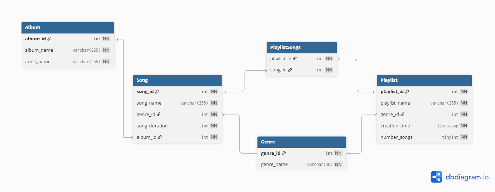

# Definitions
##  Difference between the physical model and the conceptual or logical models
The difference between the physical model and the other model types is the specifics.  For a physical model you must be specific to the actual database you want to build in like MariaDB.  Here you aren't just planning anymore and have to actual think on what will end up being used like data types.
## Common Data Types
* Character data types
  * CHAR - this data type says that amount of characters in this must be of the chars length
  * VARCHAR - this is a variable string length with a maximum of the varchar value
  * TEXT - holds a nonbinary string has multiple sizes including tiny, medium, and long
* Number datatypes
  * DEC - Used for numbers that have a floating point value 
  * INT - a data type that holds a amount of whole numbers with sizes tiny, medium and big
* Time data types
  * TIMESTAMP - A timestamp value in CCYY-MM-DD hh:mm:ss format
  * TIME - A time value in hh:mm:ss format
## Default values
This is the default value that a table will assign to an column when the entry doesn't specify a different option.  This can be set to any catch all that would work for a column or be a null.  
## Null Values
An important option when making a table is to decide whether a column within the table should be able to contain a null value.  This means you need to question whether the piece of information can be left blank. You don't want that to be an option for any kind of mandatory information such as an id but optional values like a second home address shouldn't be required for everyone.
## Check constraints
Check constraints are used to limit what information can be put into a column.  This can be limiting a varchar to only be allowed to input a specific set of inputs or a int being limited to a range of values.

# Models

## Logical
Our logical model can be found [here](../logical_model/README.md)
## Physical
This is my design for our physical model

First is the genre table.  This table is very simple only having an id that is an int that is used to uniquely identify each genre.  As well it as a varchar for the name of the genre.  
This genre table is used as foreign key in first the playlist table.  This table similarly uses a int for its playlist id and a varchar for its the name of the playlist.  It has the foreign key from the genre table.  Then it will use timestamp for the creation time to get the exact time the playlist was created.  This uses the default time stamp so the exact time doesn't need to be inputted. Finally a tinyint is used for the number of songs because the value doesn't need to be huge.  
Next is the album table that uses an int for its id and varchar for the album name and artist name.  
The song table has two foreign keys that both use ints it takes the album id and the genre id.  It  use an int to uniquely identify itself.  Along with all that it use a varchar to hold the songs name.  Finally the song duration is held in a time data type to get the exact length of the song. 